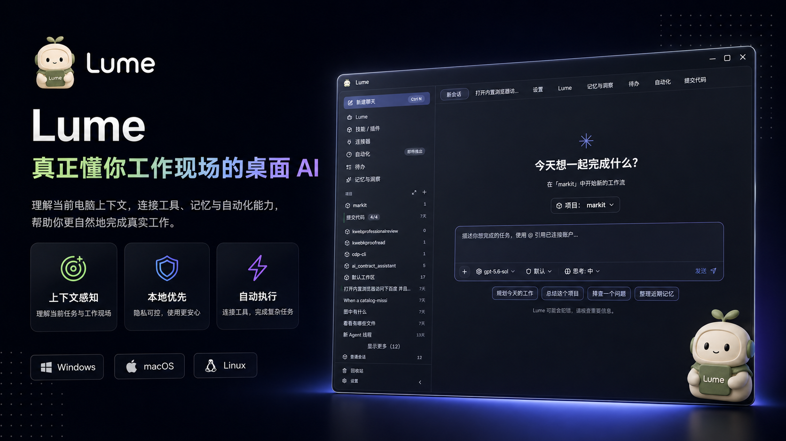

<div align="center">
  

# Lume

本地优先的 AI 工作台 — 有记忆、有主见、能动手。

[](https://github.com/CavinHuang/lume/actions/workflows/ci.yml)
[](./LICENSE)


**你的数据在你手上，你的助手为你工作。**

</div>

<p align="center">
  
</p>

## 为什么是 Lume

多数 AI 产品是一扇转门：打开浏览器，登录，对话，关闭——下次回来一切从零。它不记得你昨天在做什么，碰不到你的文件系统，更不会在你睡觉时推进任何事。

Lume 运行在你自己的电脑上。记忆、对话、项目上下文、技能配置，全部是 `~/.lume/` 下可直接读写的本地文件；配合完整工具集和有性格的角色团队，它能真正参与你的工作流，而不是旁观。

## 核心特性

- **本地优先** — 所有数据存在 `~/.lume/`。Markdown 是真源、向量索引只是缓存：`cat ~/.lume/memories/*.md` 随时可读，可 grep、可备份、可迁移。
- **持久记忆** — 三层作用域（global / workspace / thread）× 六种类型（fact / preference / decision / lesson / episode / milestone），新对话中自然召回；矛盾记忆并存，由你决定取舍，绝不静默覆盖。
- **角色团队** — 11 位有独立风格与专长的角色（开发者、作家、分析师、调研员、画师、设计师……），主线程理解任务后分发给最合适的人。
- **27+ Skills** — 每个 Skill 是一个 `SKILL.md` 提示词模板，支持热加载，修改即生效；配合自我进化机制，越用越准。
- **完整工具集** — 文件系统（Read / Write / Edit / Glob / Grep）、Bash（超时 + 后台）、、Web 搜索与抓取、图片生成、标准 MCP 客户端。
- **自动化** — cron 定时任务、每日日程，到点自动执行并把结果推送到指定渠道。
- **IM 与阅读** — 微信接入（消息自动绑定工作区线程）；微信读书书架/划线同步 + 两阶段智能笔记管线。
- **多模型** — OpenAI 兼容接口接入 OpenAI / Anthropic / Gemini / DeepSeek / GLM / 通义 / 豆包 / Moonshot 等，可按任务分配不同模型。

## 快速开始

前置要求：[Node.js](https://nodejs.org/) >= 20、[Bun](https://bun.sh/) >= 1.0；构建桌面 native 能力另需 [Rust](https://www.rust-lang.org/) stable。

```bash
git clone https://github.com/CavinHuang/lume.git
cd lume
bun install

# 开发模式：同时启动前端 + 桌面端
bun dev

# 构建桌面应用
bun build:desktop
```

桌面运行时只有 Electron。Rust 能力构建为 `apps/desktop/resources/natives/<platform>-<arch>/lume-natives.node`，由 UtilityProcess sidecar 加载。

## Agent SDK

Agent 引擎以独立 SDK 提供，完整的 Agent 循环——工具调用、上下文管理、流式输出——全在进程内完成，无本地 CLI 依赖，可部署到云端、Serverless、Docker、CI/CD：

```typescript
import { createAgent } from '@lume/agent-sdk'

const agent = createAgent({
  model: 'claude-sonnet-4-6',
  maxTurns: 10,
})

for await (const event of agent.query('Read package.json and summarize the project.')) {
  // 流式事件：assistant 文本 / 工具调用 / result 统计
}
```

## 配置

全局配置入口：`~/.lume/lume.yaml`

```yaml
# 模型配置
models:
  default: openai/gpt-4o

# 工作区
workspaces:
  my-project:
    path: ~/projects/my-project
    context: .context/

# MCP 服务器
mcp:
  my-server:
    command: npx
    args: ["-y", "my-mcp-server"]
```

## 架构

```
Lume
├── apps/
│   ├── desktop/              # Electron 桌面应用
│   ├── web/                  # Vite + React 前端
│   └── sidecar/              # Electron 子进程核心（Agent runtime + 工具 + 记忆 + IM）
├── packages/
│   ├── sdk/                  # @lume/agent-sdk — 可嵌入的 Agent SDK
│   ├── natives/              # @lume/natives — Rust N-API 性能模块加载器
│   ├── shared/               # 跨端共享类型和工具
│   └── ui/                   # 共享 UI 组件库
├── crates/
│   ├── lume-ast/             # Rust AST 摘要能力
│   └── lume-natives/         # 输出 .node 动态库，不是桌面 runtime
└── plugins/                  # 外部插件
```

技术栈：Electron · React · TypeScript · Bun（包管理与构建）· Rust N-API（仅构建 `.node` 性能模块）

## 贡献

欢迎贡献！请先阅读 [AGENTS.md](./AGENTS.md) 了解工作协议。Commit 格式：

```
✨ feat(web): 添加流式工具执行器
🐛 fix(sidecar): 修复子代理串行执行问题
♻️ refactor(sdk): 重构 provider 类型定义
```

## License

[MIT](./LICENSE)

---

<div align="center">

**Lume — 本地优先，记忆持久，属于你。**

[🐛 Issues](https://github.com/CavinHuang/lume/issues) · [🚀 Releases](https://github.com/CavinHuang/lume/releases)

</div>
