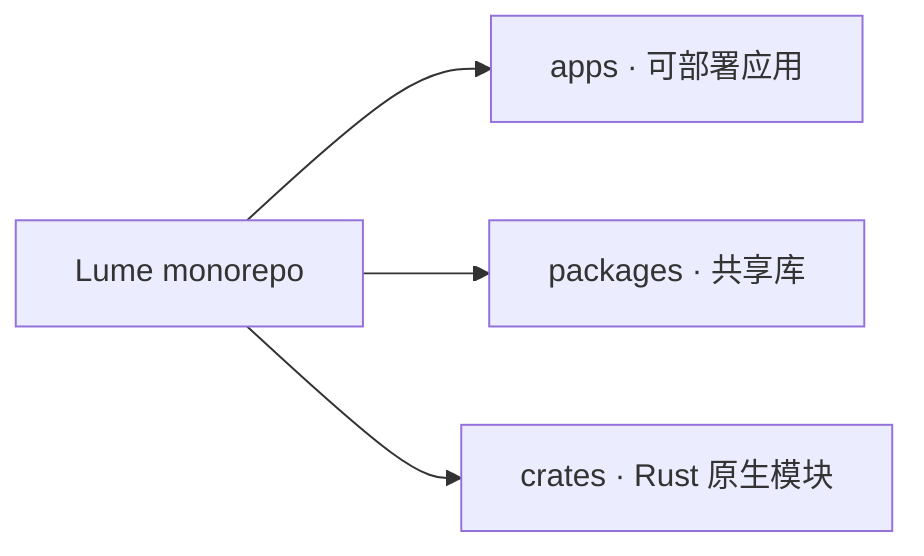
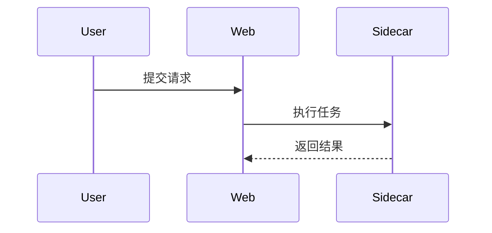

# Lume Mermaid 图解

只输出 Lume 当前渲染器能够正确显示的 Mermaid，不套用官方 Mermaid 的完整语法能力。

## 选择图类型

- 流程、架构、依赖、层级：使用 `flowchart TD` 或 `flowchart LR`。
- 交互顺序、调用链：使用 `sequenceDiagram`。
- 状态变化：使用 `stateDiagram-v2`。
- 类型关系：使用 `classDiagram`。
- 数据实体关系：使用 `erDiagram`。

## 兼容语法

- Flowchart 节点使用 `A[普通单行文本]`，不要写成 `A["带引号文本"]`。
- 标签保持单行；不要使用 ` `、` `、Markdown 或其他 HTML。需要分隔时使用 `·`、`/` 或缩短文案。
- 使用简短稳定的 ASCII 节点 ID，把中文放在标签中。
- 只使用简单连线，如 `-->`、`-.->`、`==>`；边标签使用 `-->|标签|`。
- 只在关闭 `subgraph` 时使用 `end`，不要在普通 Flowchart 末尾添加 `end`。
- 不要输出当前渲染器不支持的 `accTitle`、`accDescr`、`click` 或初始化指令。
- 默认不超过 12 个节点；更复杂时拆成多张小图。

## 工作流程

1. 先选择最能表达关系的图类型和方向。
2. 再把节点文案缩短到一眼可读，避免在图中复述正文。
3. 输出一个 `mermaid` fenced code block。
4. 输出前检查：无 Flowchart 标签引号、无 HTML、无多余 `end`、无孤立节点、节点不超过 12 个。

## 示例

架构或依赖关系：

调用顺序：

