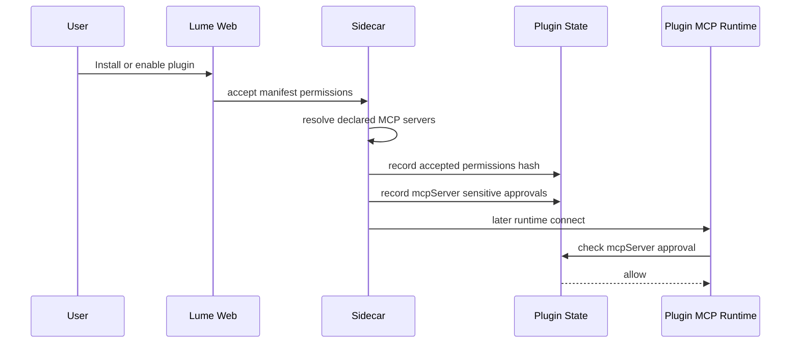
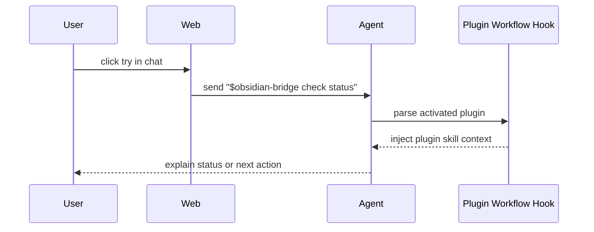
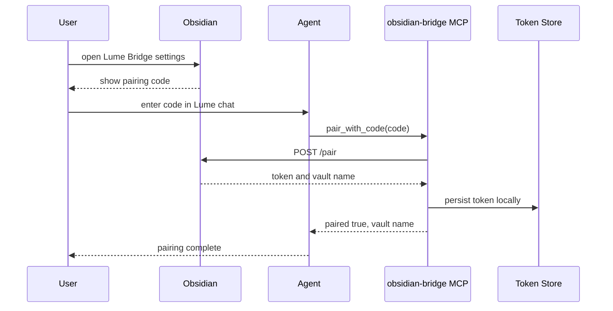
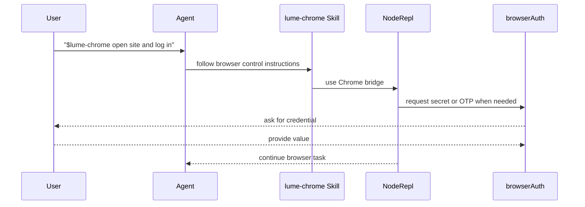

# 插件授权交互闭环设计

Status: A 方案已确认，等待规格审阅后进入实现计划
Date: 2026-07-05

## 背景

当前插件详情页已经能展示插件概览、README 和设置入口，但插件真正被使用时还有三个断点：

1. 插件安装时用户已经接受权限，但运行时 MCP server 仍可能被敏感能力门禁拦住。
2. Agent 的系统上下文主要来自工作区技能目录，插件运行时注册的技能和工具没有被稳定呈现给模型。
3. Obsidian 插件的验证码在 Obsidian 内生成，但 Lume 内没有明确的输入、配对、持久化路径。

用户选择的 A 方案是补齐完整交互闭环，而不是只增加一个输入框：

1. 插件声明 MCP 注册权限。
2. Obsidian MCP 暴露状态检查和验证码配对工具，并本地保存配对 token。
3. Lume 安装或启用插件时，把已接受的 MCP 敏感能力写入插件权限状态，避免运行时重复阻断。
4. Lume 在 Agent 上下文中展示已启用插件、技能、工具和设置状态。
5. 插件详情页的“在对话中试用”要激活插件上下文，让 Agent 知道用户正在使用哪个插件。

## 目标

- 插件安装后的权限状态与运行时启动门禁一致。
- Agent 能在普通对话中知道当前可用插件，至少能看到插件名称、用途、技能入口和需要配置的状态。
- 从插件详情页进入对话时，自动携带 `$pluginId` 或等价的插件激活上下文。
- Obsidian 首次使用时，用户能把 Obsidian 里生成的验证码交给 Lume，Agent 能调用插件工具完成配对。
- Chrome 插件继续复用现有 browserAuth 交互能力，不引入新的密钥输入机制。
- 不新增依赖，不扩大插件权限模型的语义范围。

## 非目标

- 不把 Obsidian 的 token 交给 Lume 前端展示。
- 不要求所有插件都实现统一 OAuth 或通用配对协议。
- 不在本次设计里重写 MCP 管理器、插件注册器或技能系统。
- 不把 Chrome 的登录态复制到 Lume；Chrome 仍由现有浏览器和 browserAuth 流程处理。
- 不为未使用插件主动启动所有 MCP server。

## 当前流程与问题

### 插件发现与运行

Sidecar 在 Agent runtime 启动时读取有效插件配置，扫描已注册插件，然后组装插件 runtime：

- 插件 skills 会注册进 SDK skill registry，名称使用 `${pluginId}:${skillName}`。
- 插件 MCP server 会通过 transient `WorkspaceMcpManager` 加入工具运行时，工具来源标记为 `plugin`。
- 插件 workflow hook 已支持 `$plugin:skill` 和 `$plugin` 显式激活，并能注入已激活插件技能说明。

问题是 Lume prompt builder 的已加载技能列表仍主要来自工作区技能目录，未把 runtime 中注册的插件技能稳定纳入模型上下文。结果是插件实际上可用，但 Agent 不一定知道该主动使用它。

### MCP 权限过滤

插件 manifest 的 MCP 配置需要 `permissions.mcpServers.register` 允许。SDK manifest 默认值是 `false`。如果插件有 MCP 配置但没有声明 register 权限，capability resolver 会过滤掉 MCP server。

Obsidian 插件当前声明了 `mcpServers` 和网络访问，但没有声明 `permissions.mcpServers.register: true`，因此 MCP server 可能不会被注册。

### MCP 敏感能力门禁

插件 MCP server 的连接授权会检查敏感能力 key：

```text
mcpServer:${pluginId}:${serverId}
```

安装状态现在记录了用户接受的插件权限摘要，但 `sensitiveApprovals` 为空。即使 manifest 增加了 MCP register 权限，运行时 MCP connect 仍可能因为敏感能力决策是 `ask` 而被阻断。

### Obsidian 配对

Obsidian 端能生成验证码，MCP client 也有 `pair(code)` 能力，但 MCP server 当前没有公开配对工具，也没有真实的 token 持久化。现有代码只读取 `OBSIDIAN_BRIDGE_TOKEN`，并注释“配对后由 Lume 注入”，但 Lume 没有这条注入链路。

这导致用户不知道在 Lume 哪里输入验证码，Agent 也无法自行完成配对。

## 设计

### 1. 插件安装与启用时同步 MCP 敏感授权

当用户在插件安装或启用流程中接受权限后，Lume 需要根据插件声明的 MCP server 列表写入对应敏感能力授权。

规则：

- 只为 manifest 已声明且用户已接受的 MCP server 写授权。
- key 使用运行时一致的 namespaced id：`mcpServer:${pluginId}:${serverId}`。
- 授权作用域跟随安装或启用作用域：
  - 工作区安装或工作区启用：写入 workspace-scoped approval。
  - 全局安装或全局启用：写入 global approval。
- 插件更新后，如果 MCP server 列表或权限 hash 变化，重新进入权限审查，不复用旧 hash 下的隐式授权。
- 卸载或禁用插件不需要删除历史 approval，但运行时只应加载当前启用插件。

这样权限审查仍发生在安装或启用时，运行时 connect 不再弹出一个 Agent 无法处理的隐式阻断。

### 2. Agent 上下文加入插件运行时摘要

Sidecar 在构造 Agent prompt 或上下文时，需要把当前启用插件的 runtime 摘要加入模型可见上下文。

建议新增一个轻量的插件上下文块，内容来自已组装的 plugin assembly，而不是重新扫描文件系统：

```text
<enabled_plugins>
- obsidian-bridge: Connect Lume to a local Obsidian vault.
  skills: obsidian-bridge:obsidian-bridge
  tools: read_note, search_notes, upsert_note, bridge_status, pair_with_code
  setup: pairing_required | ready | unavailable
- lume-chrome: Control Chrome through Lume's node_repl bridge.
  skills: lume-chrome:control-browser
  tools: mcp__node_repl__js
  setup: ready
</enabled_plugins>
```

约束：

- 只展示已启用插件。
- 不展示 secret、token、完整本地路径。
- 工具列表可以截断，但必须保留设置相关工具，如 `bridge_status`、`pair_with_code`。
- 当插件 capability 被过滤或 MCP 启动失败时，要把状态写成可解释的诊断，例如 `mcp_permission_missing`、`mcp_start_blocked`、`pairing_required`。
- 保留现有 `$plugin` workflow hook；插件详情页试用入口优先使用该机制触发更详细的插件技能说明。

### 3. 插件详情页“在对话中试用”携带插件激活上下文

插件详情页的试用入口不只是打开一个空对话。它应该在新对话或当前对话里插入可被 workflow hook 识别的插件激活前缀。

行为：

- 从 `obsidian-bridge` 详情页进入：初始消息包含 `$obsidian-bridge`。
- 从 `lume-chrome` 详情页进入：初始消息包含 `$lume-chrome`。
- 如果插件有 README 或 setup metadata，可把默认提示压缩成一句任务导向文案，例如：
  - `$obsidian-bridge 帮我检查 Obsidian 连接状态。`
  - `$lume-chrome 打开当前 Chrome 标签页并说明你能控制什么。`

这样 Agent 会走现有 plugin hook，不需要前端手写插件专用逻辑。

### 4. Obsidian MCP 增加配对工具与本地 token store

Obsidian 插件需要把配对流程放进 MCP server，而不是依赖 Lume 注入环境变量。

新增工具：

- `bridge_status`
  - 检查本地 Obsidian HTTP bridge 是否可达。
  - 返回 vault 名称、bridge 版本、是否已有本地 token、是否需要验证码。
  - 不返回 token。
- `pair_with_code`
  - 输入 `{ code: string }`。
  - 调用 Obsidian `/pair`。
  - 成功后把 token 写入插件本地 token store。
  - 返回 `{ paired: true, vaultName }`。
  - 不把 token 写入 stdout、日志或工具结果。
- `forget_pairing`
  - 删除本地 token。
  - 用于切换 vault 或修复错误配对。

token 获取顺序：

1. `OBSIDIAN_BRIDGE_TOKEN` 环境变量，用于调试和高级用户覆盖。
2. 插件本地 token store。
3. 空值，现有读写工具返回需要配对的错误。

token store 约束：

- 不新增加密依赖。
- 默认路径应位于 Lume 或插件可写数据目录下，并支持环境变量覆盖，便于测试。
- 文件权限尽量使用当前平台可用的用户私有写入方式。
- 读取失败应返回可操作诊断，而不是把异常直接暴露给 Agent。

现有读写工具遇到未配对或 token 失效时，应返回明确提示：

```text
Obsidian bridge is reachable but not paired. Ask the user for the pairing code shown in Obsidian, then call pair_with_code.
```

### 5. Chrome 插件保持 browserAuth 路径，补齐可发现性

Chrome 插件已经通过 `node_repl` 和 `browserAuth.request` 支持登录、密码、OTP 等交互。它不需要新增验证码输入或 token store。

需要补齐的是可发现性：

- 插件 manifest 和 README 明确说明它依赖 Lume 的 `node_repl` bridge。
- Agent 上下文列出 `lume-chrome` 的技能和关键工具。
- 插件详情页试用入口自动激活 `$lume-chrome`。
- 如果 `node_repl` 不可用，插件详情页和 Agent 上下文应显示 `tool_unavailable` 诊断。

## 交互流程

### 安装或启用插件



### 从插件详情页试用



### Obsidian 首次配对



### Chrome 授权



## 错误与诊断

用户可见诊断应分层：

- `permission_review_required`: 插件权限 hash 变化，需要重新接受权限。
- `mcp_permission_missing`: manifest 未声明 MCP register 权限。
- `mcp_start_blocked`: 缺少敏感 MCP approval。
- `mcp_start_failed`: command、路径或环境变量导致 server 启动失败。
- `bridge_unreachable`: Obsidian 本地 HTTP bridge 不可达。
- `pairing_required`: Obsidian bridge 可达但没有 token。
- `pairing_failed`: 验证码错误、过期或 Obsidian 拒绝。
- `tool_unavailable`: 插件依赖的底层工具不可用，例如 Chrome 插件缺少 `node_repl`。

这些状态可以先进入 Agent 上下文和工具结果；插件详情页只展示摘要和下一步行动，不需要实现复杂排障 UI。

## 安全约束

- token 永不出现在工具结果、日志、README 示例或前端状态。
- 验证码只由用户从 Obsidian 拷贝到 Lume，不由 Lume 主动读取 Obsidian UI。
- MCP 敏感授权只从用户接受权限的安装或启用路径写入，不由 Agent 自行授权。
- 插件详情页可以展示权限和状态，但不能提供绕过权限审查的快捷入口。
- Chrome 登录、密码、OTP 继续走 `browserAuth`，不要复用 Obsidian token store。

## 实现顺序

1. Lume 平台权限闭环
   - 解析安装插件声明的 MCP server id。
   - 在权限接受后写入匹配的 sensitive approval。
   - 为权限 hash 变化保留重新审查路径。

2. Lume Agent 可发现性
   - 从 plugin runtime assembly 生成 enabled plugin summary。
   - 注入 prompt 或上下文组装器。
   - 保留并复用现有 `$plugin` hook。

3. 插件详情页试用入口
   - 使用插件 id 生成 `$pluginId` 激活前缀。
   - 默认提示优先执行状态检查或说明能力。

4. Obsidian 插件配对
   - manifest 声明 MCP register 权限。
   - 增加 token store。
   - 增加 `bridge_status`、`pair_with_code`、`forget_pairing`。
   - 更新 README 和 skill 文档。

5. Chrome 插件可发现性
   - 更新 README、skill 或 metadata，明确 node_repl/browserAuth 交互。
   - 如平台支持状态摘要，显示 `node_repl` 可用性。

## 验证计划

Lume 平台：

- 插件安装接受权限后，插件状态包含 MCP sensitive approval。
- 插件 MCP server 在权限已接受时可以 connect。
- 权限 hash 变化后不复用旧审查结果。
- Agent prompt 或上下文包含已启用插件摘要。
- 插件详情页试用入口生成 `$pluginId` 激活消息。

Obsidian 插件：

- manifest 权限允许 MCP register。
- 无 token 时 `bridge_status` 返回 pairing required。
- `pair_with_code` 成功后写入本地 token store。
- 后续读写工具能从 token store 读取 token。
- token 失效时返回可操作配对提示，不泄露 token。

Chrome 插件：

- `$lume-chrome` 激活后 Agent 能看到 browser control skill。
- browserAuth 仍由现有 `node_repl` 路径触发。

## 取舍

- 选择插件 MCP 内部完成 Obsidian 配对，而不是 Lume 前端做插件专用验证码表单。这样可以保留插件自治，并让 Agent 能解释和执行配对。
- 选择安装或启用时写 MCP sensitive approval，而不是运行时再问。运行时阻断发生在 Agent 背后，用户很难理解，也会让插件表现为“安装了但不可用”。
- 选择给 Agent 注入插件摘要，而不是只依赖 README tab。README 是给用户看的，Agent 需要结构化的当前可用能力提示。
- 选择继续使用 `$plugin` hook，而不是为每个插件写前端分支。这样详情页试用和普通对话共享同一套激活机制。

## 待确认事项

没有阻塞实现的开放问题。实现时需要在现有插件 state 和 permission runtime 中选择最小改动点，避免引入新的权限存储模型。
